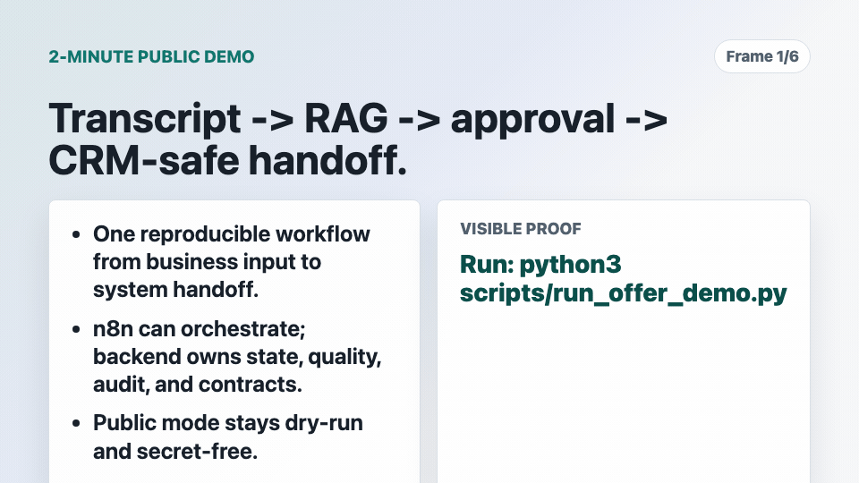
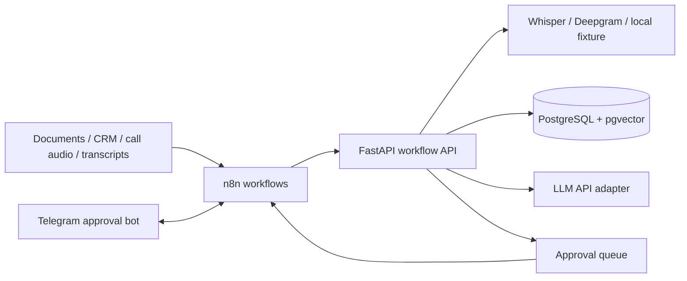

# AI Ops Workflow Kit

[](https://github.com/AlexGerlitz/ai-ops-workflow-kit/actions/workflows/ci.yml)

Production-minded reference implementation for AI workflow orchestration around business operations:
document/CRM/call intake, RAG retrieval, call-audio transcription contracts, transcript analysis,
approval queues, outbox handoff, and n8n/Telegram/CRM integration surfaces.

The project keeps the workflow engine thin and moves stateful logic into a backend service. n8n can own
webhooks, retries, notifications, and human-in-the-loop routing while the API owns RAG, scoring, audit-friendly
state transitions, and integration contracts.

Profile / contact route: [DriveDesk AI Operator proof route](https://alexgerlitz.github.io/AlexGerlitz/drivedesk-proof-route.html),
[LinkedIn message route](https://www.linkedin.com/in/alex-gerlitz-a659ab3bb/),
[PDF resume](https://alexgerlitz.github.io/AlexGerlitz/output/pdf/alex-gerlitz-remote-ai-automation-resume.pdf),
[portfolio](https://alexgerlitz.github.io/AlexGerlitz/),
[enterprise readiness](https://alexgerlitz.github.io/AlexGerlitz/enterprise-readiness.html), and
[inbound brief](https://alexgerlitz.github.io/AlexGerlitz/intake-brief.html).

Message me first when there is one messy sales/support workflow, one risky CRM or approval
handoff, or one backend-owned AI workflow slice that should become testable, logged,
documented, and handed off.

Shortest proof path: [LinkedIn Recruiter Packet](https://alexgerlitz.github.io/AlexGerlitz/linkedin-recruiter-packet.html) ->
[Hiring Decision](https://alexgerlitz.github.io/AlexGerlitz/hiring-decision.html) ->
[DriveDesk Proof Route](https://alexgerlitz.github.io/AlexGerlitz/drivedesk-proof-route.html) ->
[PDF resume](https://alexgerlitz.github.io/AlexGerlitz/output/pdf/alex-gerlitz-remote-ai-automation-resume.pdf).

First useful result: a verified RAG/transcript/approval/CRM slice with backend-owned
state, tests, logs, docs, and a handoff route.



Short visual route: [Demo walkthrough](docs/DEMO_WALKTHROUGH.md).


## 60-Second Reviewer Snapshot

This repository is public proof for AI workflow automation work where the output must be more than a
prompt demo.

Hiring relevance: I can turn an AI sales/support workflow into a backend-owned
system where state, RAG quality, privacy redaction, approvals, retries, audit,
idempotency, CRM contracts, n8n orchestration, Telegram approvals, Docker, CI,
and reviewer evidence are all explicit instead of hidden inside no-code glue.

| What to check | Why it matters |
| --- | --- |
| [Stable reviewer route](docs/PUBLIC_PROOF_STATUS.md) | Current proof status, CI, local gate, committed evidence, live-runtime boundary, and fallback review path in one page. |
| [Hiring signal brief](docs/evidence/hiring-signal-brief.txt) | Shortlist-focused proof that combines business replay and production-readiness drill signals into one high-bar backend/platform screen. |
| [Business scenario replay](docs/evidence/business-scenario-replay.txt) | Short business-input -> backend-route -> RAG/approval/CRM result for a reviewer who wants the outcome before reading code. |
| [Demo walkthrough](docs/DEMO_WALKTHROUGH.md) | Short GIF route for transcript -> RAG -> approval -> CRM-safe handoff, generated from the public-safe offer demo. |
| [Runtime demo notes](docs/LIVE_DEMO.md) | Availability-dependent VPS demo notes for the browser-visible Sales Ops workflow; use them after the public proof status page confirms the edge is reachable. |
| [Live approval proof](docs/LIVE_OWNER_PROOF.md) | Real Telegram approval callback proof: approved item -> queued CRM handoff, while Bitrix24 stays dry-run. |
| [Reviewer acceptance report](docs/REVIEWER_ACCEPTANCE_REPORT.md) | Live-runtime acceptance pass across API, smoke, GitHub Actions state, Pages route, and public PDF when the VPS edge is reachable. |
| [Public proof status](docs/PUBLIC_PROOF_STATUS.md) | Current CI, local verification gate, committed evidence, runtime boundary, Pages route, and public boundary status. |
| [CI workflow](.github/workflows/ci.yml) | Deterministic tests for workflow state, RAG boundaries, integration contracts, and public verification. |
| Reviewer observability snapshot | `GET /reviewer/observability` returns a read-only reviewer observability snapshot for runtime identity, counters, RAG quality gate, privacy boundary, approval counts, outbox state, adapter dry-run status, and worker boundary. |
| [Privacy boundary](docs/PRIVACY_BOUNDARY.md) | Safe-logging proof: transcript PII is redacted before RAG ingestion, approval context, CRM handoff, demo JSON, and reviewer snapshots. |
| RAG quality proof | `/rag/eval` and `/demo/run` return expected-source checks with citations, required terms, score floor, and pass/fail output. |
| [Role requirements map](docs/ROLE_REQUIREMENTS_MAP.md) | Role-level AI automation requirements mapped to files, endpoints, commands, and production boundaries. |
| [Employer Trigger Proof](docs/EMPLOYER_TRIGGER_PROOF.md) | Hiring/project triggers mapped to concrete repo evidence, proof commands, and the first result this system demonstrates. |
| [First Slice Playbook](docs/FIRST_SLICE_PLAYBOOK.md) | Short route from inbound role/project context to the first shippable slice, done criteria, proof command, and handoff artifact. |

Best-fit evidence:

- RAG/backend ownership: document and CRM intake contracts, connector/export adapters, chunking, retrieval, deterministic retrieval-quality eval, pgvector-ready storage, OpenAI/Claude/Gemini LLM boundary, and Whisper/Deepgram transcription boundary;
- human-in-the-loop workflow ownership: approval queue, explicit state transitions, Telegram inline callback handling, and n8n integration shape;
- business automation ownership: call-audio webhook, transcription normalization, transcript scoring, context capture, and review routing;
- regulated-workflow ownership: safe logging and PII redaction before RAG, approval context, CRM handoff, and public evidence;
- engineering discipline: deterministic local embeddings, tests, Docker runtime, docs, and CI.

Fast evaluation path:

1. Open `docs/PUBLIC_PROOF_STATUS.md`.
2. Run `bash scripts/verify_public.sh`.
3. Read `docs/evidence/hiring-signal-brief.txt`.
4. Read `docs/evidence/business-scenario-replay.txt`.
5. Open `docs/LIVE_OWNER_PROOF.md`.
6. Run `python3 scripts/reviewer_acceptance_report.py` when `https://saleops.duckdns.org/` is reachable.
7. Open `docs/ROLE_REQUIREMENTS_MAP.md`.
8. Review `infra/n8n/` to see the orchestration boundary.

## Drill-Down Index

| Surface | Proof |
| --- | --- |
| Public status | [Public proof status](docs/PUBLIC_PROOF_STATUS.md) with current CI, local gate, committed evidence, runtime reachability boundary, Pages route, and public boundary. |
| Demo walkthrough | [Demo walkthrough](docs/DEMO_WALKTHROUGH.md) with a short GIF generated from the public-safe offer demo. |
| Hiring signal brief | [Hiring signal brief](docs/evidence/hiring-signal-brief.txt) and [sanitized JSON](docs/evidence/hiring-signal-brief.sanitized.json) combine replay and readiness drill evidence into a shortlist-focused screen. |
| Business scenario replay | [Business scenario replay](docs/evidence/business-scenario-replay.txt) and [sanitized JSON](docs/evidence/business-scenario-replay.sanitized.json) compress the offer demo into business input, backend route, proof signals, and handoff artifacts. |
| Employer trigger proof | [Employer Trigger Proof](docs/EMPLOYER_TRIGGER_PROOF.md) maps AI workflow/RAG, CRM/API integration, backend/platform ownership, and DevOps reliability triggers to inspectable code, docs, and commands. |
| First slice playbook | [First Slice Playbook](docs/FIRST_SLICE_PLAYBOOK.md) maps inbound role/project context to RAG/transcript, CRM handoff, human approval, and reliability slices with done criteria. |
| Live approval proof | [Live approval proof](docs/LIVE_OWNER_PROOF.md) for Telegram callback approval and CRM-safe outbox handoff. |
| Integration boundaries | [Public proof status](docs/PUBLIC_PROOF_STATUS.md), [reviewer acceptance report](docs/REVIEWER_ACCEPTANCE_REPORT.md), and committed sanitized artifacts for Telegram and Bitrix24 boundary checks. |
| Offer demo | [Offer demo](docs/OFFER_DEMO.md) for document import -> RAG -> call-audio transcription boundary -> transcript scoring -> Telegram approval -> outbox drain -> dry-run Bitrix24 handoff. |
| Reviewer gate | [Reviewer checklist](docs/REVIEWER_CHECKLIST.md), [CI workflow](.github/workflows/ci.yml), and deterministic tests in [tests/](tests/). |
| Privacy boundary | [Privacy boundary](docs/PRIVACY_BOUNDARY.md) for transcript PII redaction before RAG, approval context, CRM handoff, demo JSON, and reviewer evidence. |
| RAG quality eval | `/rag/eval`, `app/rag_eval.py`, and `/demo/run` prove expected-source retrieval with citations before an LLM answer is trusted. |
| Runtime docs | [Live demo notes](docs/LIVE_DEMO.md), [Operations notes](docs/OPERATIONS.md), and runtime endpoints `/runtime`, `/reviewer/observability`, `/llm/runtime`, `/transcription/runtime`, `/integrations/runtime`, `/metrics`. |
| Architecture | [Architecture notes](docs/ARCHITECTURE.md), [Evidence map](docs/EVIDENCE_MAP.md), and [Integration skeleton](docs/INTEGRATION_SKELETON.md). |
| n8n boundary | [n8n approval flow](docs/N8N_APPROVAL_FLOW.md) and importable workflows in [`infra/n8n/`](infra/n8n/). |

## System Shape



## What It Demonstrates

- FastAPI service boundary for AI workflow orchestration.
- Browser-visible Sales Ops Control Tower demo at `/`.
- Document intake contracts for exported document text from n8n, Google Drive, CRM, or another connector.
- Call-audio webhook and browser upload endpoint that convert audio through a transcription provider boundary into normalized transcript text.
- Transcription runtime endpoint for OpenAI Whisper, Deepgram, and deterministic local fixture without exposing secrets.
- RAG ingestion and retrieval with deterministic local embeddings for repeatable development.
- RAG quality evaluation with expected source, required terms, score floor, citations, and pass/fail output.
- pgvector-ready schema and Docker Compose runtime.
- Transcript webhook that produces a structured analysis and a human approval item.
- Safe-logging boundary that redacts transcript PII before RAG ingestion, approval context, CRM handoff, and public evidence.
- Dry-run Bitrix24 CRM handoff event queued only after human approval; the Bitrix adapter can be credentialed later without changing the approval/RAG flow.
- CRM outbox state with idempotency keys, attempt counters, retry scheduling, last error, and dead-letter handling.
- Optional background worker for Bitrix24 outbox drain, disabled in public dry-run mode.
- Dry-run document intake and Bitrix24 dispatch contracts ready for real credentials.
- Telegram approval can run live for operator-triggered approvals while the public synthetic demo stays dry-run.
- Telegram callback webhook for inline approve/reject decisions.
- Optional Telegram webhook secret verification for production callbacks.
- Approval state machine for Telegram, CRM, or internal review loops.
- n8n workflow examples for document-to-RAG and webhook-to-API-to-approval routing.
- Runtime evidence endpoints for version, deploy environment, counters, and Prometheus-style metrics.
- Tests around chunking, embeddings, retrieval, and approval state transitions.

## Offer Demo

```bash
python3 -m pip install -r requirements.txt
python3 scripts/run_offer_demo.py
python3 scripts/business_scenario_replay.py
```

The script runs a complete synthetic sales workflow without external API keys:

```text
Document playbook import -> RAG retrieval -> call audio transcription -> transcript analysis
-> follow-up approval -> Telegram callback -> outbox drain -> dry-run Bitrix24 CRM handoff event
```

See [docs/OFFER_DEMO.md](docs/OFFER_DEMO.md) for the reviewer path and expected output shape.

Full public verification gate:

```bash
bash scripts/verify_public.sh
```

Live deployment smoke:

```bash
python3 scripts/capture_reviewer_evidence.py
python3 scripts/reviewer_snapshot.py
python3 scripts/production_readiness_drill.py
python3 scripts/credentialed_sandbox_preflight.py
python3 scripts/credentialed_sandbox_preflight.py --require-target telegram
python3 scripts/credentialed_sandbox_preflight.py --require-target bitrix24
python3 scripts/live_telegram_approval_evidence.py --approval-id <approved-approval-id>
python3 scripts/bitrix24_contract_evidence.py
bash scripts/smoke_live_demo.sh
bash scripts/smoke_live_demo.sh https://leadscore.duckdns.org
```

## Local Run

```bash
cp .env.example .env
docker compose up --build
```

Demo UI:

```text
http://127.0.0.1:8080/
```

Public demo:

```text
https://saleops.duckdns.org/
https://leadscore.duckdns.org/
```

API:

```bash
curl http://127.0.0.1:8080/health
curl http://127.0.0.1:8080/runtime
curl http://127.0.0.1:8080/llm/runtime
curl http://127.0.0.1:8080/transcription/runtime
curl http://127.0.0.1:8080/metrics
```

Ingest a document:

```bash
curl -X POST http://127.0.0.1:8080/documents \
  -H 'content-type: application/json' \
  -d '{"source":"drive://sales-playbook","text":"Discovery calls should confirm budget, authority, need, timing, and next step.","metadata":{"team":"sales"}}'
```

Ask a RAG-backed question:

```bash
curl -X POST http://127.0.0.1:8080/query \
  -H 'content-type: application/json' \
  -d '{"question":"What should be confirmed during discovery calls?","top_k":3}'
```

Create an approval item:

```bash
curl -X POST http://127.0.0.1:8080/approvals \
  -H 'content-type: application/json' \
  -d '{"kind":"content_review","title":"Approve generated follow-up","draft":"Send a follow-up with budget, timeline, and next step.","context":{"lead_id":"L-1024"}}'
```

## API Surface

| Endpoint | Purpose |
| --- | --- |
| `GET /` | Browser-visible Sales Ops Control Tower demo. |
| `GET /health` | Runtime health and active storage mode. |
| `GET /runtime` | Runtime version, build SHA, deploy environment, public callback URL, LLM provider state, integrations, worker state, and counters. |
| `GET /metrics` | Prometheus-style runtime and workflow counters. |
| `GET /reviewer/observability` | Read-only reviewer observability snapshot: runtime identity, counters, RAG quality gate, privacy boundary, approval/outbox state, adapter dry-run status, and worker boundary. |
| `GET /llm/runtime` | Inspect the OpenAI, Claude, Gemini, and local fallback provider boundary without exposing secrets. |
| `GET /transcription/runtime` | Inspect the local fixture, OpenAI Whisper, and Deepgram transcription boundary without exposing secrets. |
| `GET /integrations/runtime` | Inspect Google Drive, Telegram, and Bitrix24 adapter configuration/dry-run status. |
| `POST /demo/run` | Run the synthetic document import through the Google Drive adapter -> call-audio transcription -> transcript -> RAG -> approval -> Telegram/Bitrix dry-run demo. |
| `POST /documents` | Chunk and ingest text into the vector store. |
| `POST /integrations/google-drive/import` | Import exported Google Drive document text into the RAG store with Drive metadata. |
| `POST /query` | Retrieve context and produce an answer draft. |
| `POST /rag/eval` | Run deterministic retrieval-quality checks against expected sources and required terms. |
| `POST /approvals` | Create a human-in-the-loop approval item. |
| `GET /approvals` | List approval items, optionally filtered by status. |
| `GET /approvals/{id}` | Inspect one approval item. |
| `POST /approvals/{id}/notify/telegram` | Build or send a Telegram approval message. |
| `POST /webhooks/telegram/approval` | Accept Telegram inline button callbacks and apply approve/reject decisions. |
| `POST /approvals/{id}/approve` | Approve an item and attach reviewer notes. |
| `POST /approvals/{id}/reject` | Reject an item and attach reviewer notes. |
| `GET /integration-events` | Inspect CRM/integration handoff events, optionally filtered by adapter or status. |
| `POST /integration-events/{id}/dispatch/bitrix24` | Dry-run or send a queued CRM event through Bitrix24, recording attempts and dead-letter state outside dry-run mode. |
| `POST /integrations/bitrix24/drain` | Worker-style drain for due queued/retry CRM events. |
| `POST /webhooks/n8n/call-audio` | Accept call audio metadata, build a transcription contract, normalize transcript text, and continue into transcript analysis. |
| `POST /webhooks/n8n/call-transcript` | Accept a transcript event, score it, ingest it, and create approval work. |

## Repository Layout

```text
app/              FastAPI application, workflow domain code, and browser demo payloads
demo/             Synthetic reference playbook and transcript fixtures
infra/n8n/        Importable n8n workflow examples
docs/             Offer demo, reviewer checklist, architecture, n8n, integrations and operations notes
scripts/          Reviewer-facing demo runner and public verification gate
tests/            Unit tests for the core behavior
docker-compose.yml
Dockerfile
```

## Checks

```bash
python3 -m pip install -r requirements.txt
bash scripts/verify_public.sh
```

## Design Notes

- The default local embedding provider is deterministic, so tests and development runs are stable without API keys.
- LLM calls are isolated behind a provider boundary. `LLM_PROVIDER=auto` can select OpenAI, Claude/Anthropic, or Gemini when the matching API key is configured; otherwise the API returns an extractive draft from retrieved context.
- Speech-to-text is isolated behind a provider boundary. Public mode uses a deterministic local fixture; OpenAI Whisper and Deepgram request contracts are visible through `/transcription/runtime` and `POST /webhooks/n8n/call-audio`.
- Postgres/pgvector owns durable retrieval data; n8n owns workflow routing and external connectors.
- Approval transitions are explicit and narrow: `pending -> approved` or `pending -> rejected`.
- The webhook contract is structured so Bitrix, telephony, Google Drive, or Telegram can be connected without rewriting RAG logic.
- Google Drive and Bitrix24 are dry-run by default, so public checks prove payload shape without exposing secrets.
- The synthetic public demo keeps Telegram dry-run; operator-triggered approvals can use the real Telegram bot and are captured as sanitized evidence.
- Bitrix24 evidence includes a read-only live sandbox check for `profile` and `crm.lead.fields`, plus a committed contract artifact for the `crm.lead.update` request body.
- Real Bitrix24 dispatches are recorded as integration attempts; retryable failures set `next_retry_at`, and repeated failures move the event to `dead_letter` with `last_error`.
- The Bitrix24 worker is opt-in and starts only when dry-run is disabled, so public demos cannot accidentally consume synthetic events.
- `/runtime` and `/metrics` expose deploy evidence without requiring log access.
