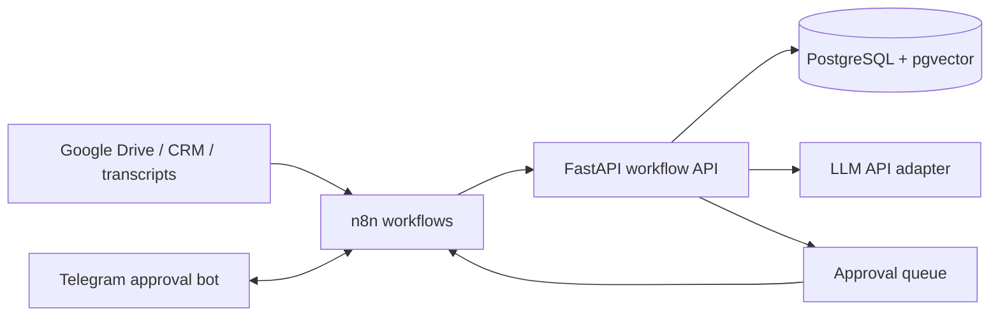

# AI Ops Workflow Kit

[](https://github.com/AlexGerlitz/ai-ops-workflow-kit/actions/workflows/ci.yml)

Production-minded reference implementation for AI workflow orchestration around business operations:
document ingestion, RAG retrieval, transcript analysis, approval queues, and n8n/Telegram integration surfaces.

The project keeps the workflow engine thin and moves stateful logic into a backend service. n8n can own
webhooks, retries, notifications, and human-in-the-loop routing while the API owns RAG, scoring, audit-friendly
state transitions, and integration contracts.

## 60-Second Reviewer Snapshot

This repository is public proof for AI workflow automation work where the output must be more than a
prompt demo.

| What to check | Why it matters |
| --- | --- |
| [Offer demo](docs/OFFER_DEMO.md) | One-command proof of transcript -> RAG -> scoring -> approval -> mock Bitrix CRM handoff. |
| [Reviewer checklist](docs/REVIEWER_CHECKLIST.md) | Single public gate for tests, offer demo, and output validation. |
| [Architecture notes](docs/ARCHITECTURE.md) | Shows the FastAPI/n8n/PostgreSQL boundary and why stateful logic stays in the backend. |
| [Operations notes](docs/OPERATIONS.md) | Shows how the system is run, checked, and handed off. |
| [n8n approval flow](docs/N8N_APPROVAL_FLOW.md) | Shows the webhook, Telegram payload, approval callback, and CRM handoff boundary. |
| [Tests](tests/) | Shows deterministic coverage around chunking, retrieval, approvals, and API behavior. |
| [CI workflow](.github/workflows/ci.yml) | Shows the public verification gate. |
| `infra/n8n/` | Shows how automation/workflow tooling connects without taking over core domain state. |

Best-fit evidence:

- RAG/backend ownership: ingestion, chunking, retrieval, pgvector-ready storage, and LLM boundary;
- human-in-the-loop workflow ownership: approval queue, explicit state transitions, and Telegram/n8n
  integration shape;
- business automation ownership: transcript webhook, scoring, context capture, and review routing;
- engineering discipline: deterministic local embeddings, tests, Docker runtime, docs, and CI.

Fast evaluation path:

1. Run `python3 scripts/run_offer_demo.py`.
2. Read `docs/OFFER_DEMO.md`.
3. Run `bash scripts/verify_public.sh`.
4. Start `docker compose up --build`.
5. Review `infra/n8n/` to see the external workflow boundary.

## System Shape



## What It Demonstrates

- FastAPI service boundary for AI workflow orchestration.
- RAG ingestion and retrieval with deterministic local embeddings for repeatable development.
- pgvector-ready schema and Docker Compose runtime.
- Transcript webhook that produces a structured analysis and a human approval item.
- Mock Bitrix24 CRM handoff event queued only after human approval.
- Approval state machine for Telegram, CRM, or internal review loops.
- n8n workflow example for webhook-to-API-to-approval routing.
- Tests around chunking, embeddings, retrieval, and approval state transitions.

## Offer Demo

```bash
python3 -m pip install -r requirements.txt
python3 scripts/run_offer_demo.py
```

The script runs a complete synthetic sales workflow without external API keys:

```text
sales playbook -> RAG retrieval -> call transcript webhook -> AI scoring
-> follow-up approval -> mock Bitrix24 CRM handoff event
```

See [docs/OFFER_DEMO.md](docs/OFFER_DEMO.md) for the reviewer path and expected output shape.

Full public verification gate:

```bash
bash scripts/verify_public.sh
```

## Local Run

```bash
cp .env.example .env
docker compose up --build
```

API:

```bash
curl http://127.0.0.1:8080/health
```

Ingest a document:

```bash
curl -X POST http://127.0.0.1:8080/documents \
  -H 'content-type: application/json' \
  -d '{"source":"drive://sales-playbook","text":"Discovery calls should confirm budget, authority, need, timing, and next step.","metadata":{"team":"sales"}}'
```

Ask a RAG-backed question:

```bash
curl -X POST http://127.0.0.1:8080/query \
  -H 'content-type: application/json' \
  -d '{"question":"What should be confirmed during discovery calls?","top_k":3}'
```

Create an approval item:

```bash
curl -X POST http://127.0.0.1:8080/approvals \
  -H 'content-type: application/json' \
  -d '{"kind":"content_review","title":"Approve generated follow-up","draft":"Send a follow-up with budget, timeline, and next step.","context":{"lead_id":"L-1024"}}'
```

## API Surface

| Endpoint | Purpose |
| --- | --- |
| `GET /health` | Runtime health and active storage mode. |
| `POST /documents` | Chunk and ingest text into the vector store. |
| `POST /query` | Retrieve context and produce an answer draft. |
| `POST /approvals` | Create a human-in-the-loop approval item. |
| `GET /approvals` | List approval items, optionally filtered by status. |
| `GET /approvals/{id}` | Inspect one approval item. |
| `POST /approvals/{id}/approve` | Approve an item and attach reviewer notes. |
| `POST /approvals/{id}/reject` | Reject an item and attach reviewer notes. |
| `GET /integration-events` | Inspect queued CRM/integration handoff events. |
| `POST /webhooks/n8n/call-transcript` | Accept a transcript event, score it, ingest it, and create approval work. |

## Repository Layout

```text
app/              FastAPI application and workflow domain code
demo/             Synthetic sales playbook and transcript for the offer demo
infra/n8n/        Importable n8n workflow example
docs/             Offer demo, reviewer checklist, architecture, n8n and operations notes
scripts/          Reviewer-facing demo runner and public verification gate
tests/            Unit tests for the core behavior
docker-compose.yml
Dockerfile
```

## Checks

```bash
python3 -m pip install -r requirements.txt
bash scripts/verify_public.sh
```

## Design Notes

- The default local embedding provider is deterministic, so tests and development runs are stable without API keys.
- LLM calls are isolated behind a client boundary. Without `OPENAI_API_KEY`, the API returns an extractive draft from retrieved context.
- Postgres/pgvector owns durable retrieval data; n8n owns workflow routing and external connectors.
- Approval transitions are explicit and narrow: `pending -> approved` or `pending -> rejected`.
- The webhook contract is structured so Bitrix, telephony, Google Drive, or Telegram can be connected without rewriting RAG logic.
