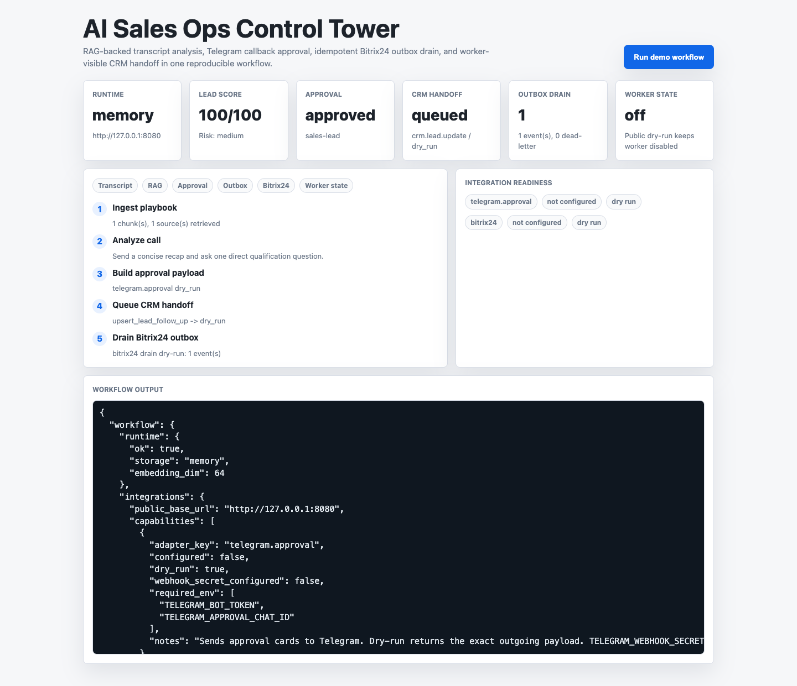
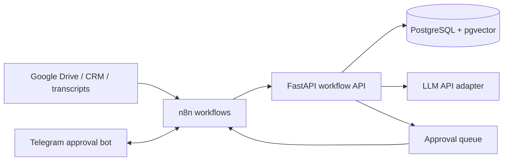

# AI Ops Workflow Kit

[](https://github.com/AlexGerlitz/ai-ops-workflow-kit/actions/workflows/ci.yml)

Production-minded reference implementation for AI workflow orchestration around business operations:
Google Drive import, document ingestion, RAG retrieval, transcript analysis, approval queues, and
n8n/Telegram integration surfaces.

The project keeps the workflow engine thin and moves stateful logic into a backend service. n8n can own
webhooks, retries, notifications, and human-in-the-loop routing while the API owns RAG, scoring, audit-friendly
state transitions, and integration contracts.



## 60-Second Reviewer Snapshot

This repository is public proof for AI workflow automation work where the output must be more than a
prompt demo.

| What to check | Why it matters |
| --- | --- |
| [Live demo](https://saleops.duckdns.org/) | Public one-click proof of the deployed Sales Ops workflow. |
| [Technical review packet](docs/TECHNICAL_REVIEW_PACKET.md) | 10-15 minute reviewer route covering live snapshot, architecture decisions, failure modes, and rollout boundaries. |
| [Reviewer evidence pack](docs/REVIEWER_EVIDENCE_PACK.md) | Committed sanitized live snapshot plus the command that regenerates it from the public deployment. |
| [Production readiness drill](docs/PRODUCTION_READINESS_DRILL.md) | Deterministic failure-mode proof for webhook auth, retry/dead-letter, drain scheduling, idempotency, and worker dry-run guard. |
| [Credentialed sandbox preflight](docs/CREDENTIALED_SANDBOX_PREFLIGHT.md) | Read-only Telegram/Bitrix24 credential boundary check that never prints tokens or writes CRM records. |
| [Evidence map](docs/EVIDENCE_MAP.md) | Maps the repo to AI automation, RAG, approval flow, Bitrix24, Telegram, and self-hosting requirements. |
| [Role requirements map](docs/ROLE_REQUIREMENTS_MAP.md) | Maps common AI automation vacancy requirements to exact files, endpoints, verification commands, and production boundaries. |
| [Offer demo](docs/OFFER_DEMO.md) | One-command proof of Google Drive import -> RAG -> transcript scoring -> Telegram approval -> idempotent outbox drain -> mock Bitrix CRM handoff. |
| [Reviewer checklist](docs/REVIEWER_CHECKLIST.md) | Single public gate for tests, offer demo, and output validation. |
| [Live demo notes](docs/LIVE_DEMO.md) | Public URLs and smoke checks for the deployed service. |
| [Architecture notes](docs/ARCHITECTURE.md) | Shows the FastAPI/n8n/PostgreSQL boundary and why stateful logic stays in the backend. |
| [Operations notes](docs/OPERATIONS.md) | Shows how the system is run, checked, and handed off. |
| [n8n approval flow](docs/N8N_APPROVAL_FLOW.md) | Shows importable transcript and Google Drive workflows, Telegram payloads, approval callbacks, and CRM handoff boundaries. |
| [Integration skeleton](docs/INTEGRATION_SKELETON.md) | Shows dry-run Telegram, Bitrix24, idempotency, retry scheduling, drain, opt-in worker, and dead-letter contracts before credentials are connected. |
| [Tests](tests/) | Shows deterministic coverage around chunking, retrieval, approvals, and API behavior. |
| [CI workflow](.github/workflows/ci.yml) | Shows the public verification gate. |
| `infra/n8n/` | Shows how automation/workflow tooling connects without taking over core domain state. |

Best-fit evidence:

- RAG/backend ownership: Google Drive import, ingestion, chunking, retrieval, pgvector-ready storage, and OpenAI/Claude/Gemini LLM boundary;
- human-in-the-loop workflow ownership: approval queue, explicit state transitions, and Telegram/n8n
  integration shape;
- business automation ownership: transcript webhook, scoring, context capture, and review routing;
- engineering discipline: deterministic local embeddings, tests, Docker runtime, docs, and CI.

Fast evaluation path:

1. Open `https://saleops.duckdns.org/` and run the browser demo.
2. Open `docs/REVIEWER_EVIDENCE_PACK.md`.
3. Run `python3 scripts/reviewer_snapshot.py`.
4. Run `python3 scripts/production_readiness_drill.py`.
5. Run `python3 scripts/credentialed_sandbox_preflight.py`.
6. Run `bash scripts/smoke_live_demo.sh`.
7. Run `bash scripts/verify_public.sh`.
8. Read `docs/TECHNICAL_REVIEW_PACKET.md`.
9. Read `docs/ROLE_REQUIREMENTS_MAP.md`.
10. Review `infra/n8n/` to see the external workflow boundary.

## System Shape



## What It Demonstrates

- FastAPI service boundary for AI workflow orchestration.
- Browser-visible Sales Ops Control Tower demo at `/`.
- Google Drive import contract for exported document text from n8n or another connector.
- RAG ingestion and retrieval with deterministic local embeddings for repeatable development.
- pgvector-ready schema and Docker Compose runtime.
- Transcript webhook that produces a structured analysis and a human approval item.
- Mock Bitrix24 CRM handoff event queued only after human approval.
- CRM outbox state with idempotency keys, attempt counters, retry scheduling, last error, and dead-letter handling.
- Optional background worker for Bitrix24 outbox drain, disabled in public dry-run mode.
- Dry-run Google Drive, Telegram approval, and Bitrix24 dispatch contracts ready for real credentials.
- Telegram callback webhook for inline approve/reject decisions.
- Optional Telegram webhook secret verification for production callbacks.
- Approval state machine for Telegram, CRM, or internal review loops.
- n8n workflow examples for Google Drive-to-RAG and webhook-to-API-to-approval routing.
- Runtime evidence endpoints for version, deploy environment, counters, and Prometheus-style metrics.
- Tests around chunking, embeddings, retrieval, and approval state transitions.

## Offer Demo

```bash
python3 -m pip install -r requirements.txt
python3 scripts/run_offer_demo.py
```

The script runs a complete synthetic sales workflow without external API keys:

```text
Google Drive playbook import -> RAG retrieval -> call transcript webhook -> AI scoring
-> follow-up approval -> Telegram callback -> outbox drain -> mock Bitrix24 CRM handoff event
```

See [docs/OFFER_DEMO.md](docs/OFFER_DEMO.md) for the reviewer path and expected output shape.

Full public verification gate:

```bash
bash scripts/verify_public.sh
```

Live deployment smoke:

```bash
python3 scripts/capture_reviewer_evidence.py
python3 scripts/reviewer_snapshot.py
python3 scripts/production_readiness_drill.py
python3 scripts/credentialed_sandbox_preflight.py
bash scripts/smoke_live_demo.sh
bash scripts/smoke_live_demo.sh https://leadscore.duckdns.org
```

## Local Run

```bash
cp .env.example .env
docker compose up --build
```

Demo UI:

```text
http://127.0.0.1:8080/
```

Public demo:

```text
https://saleops.duckdns.org/
https://leadscore.duckdns.org/
```

API:

```bash
curl http://127.0.0.1:8080/health
curl http://127.0.0.1:8080/runtime
curl http://127.0.0.1:8080/llm/runtime
curl http://127.0.0.1:8080/metrics
```

Ingest a document:

```bash
curl -X POST http://127.0.0.1:8080/documents \
  -H 'content-type: application/json' \
  -d '{"source":"drive://sales-playbook","text":"Discovery calls should confirm budget, authority, need, timing, and next step.","metadata":{"team":"sales"}}'
```

Ask a RAG-backed question:

```bash
curl -X POST http://127.0.0.1:8080/query \
  -H 'content-type: application/json' \
  -d '{"question":"What should be confirmed during discovery calls?","top_k":3}'
```

Create an approval item:

```bash
curl -X POST http://127.0.0.1:8080/approvals \
  -H 'content-type: application/json' \
  -d '{"kind":"content_review","title":"Approve generated follow-up","draft":"Send a follow-up with budget, timeline, and next step.","context":{"lead_id":"L-1024"}}'
```

## API Surface

| Endpoint | Purpose |
| --- | --- |
| `GET /` | Browser-visible Sales Ops Control Tower demo. |
| `GET /health` | Runtime health and active storage mode. |
| `GET /runtime` | Runtime version, build SHA, deploy environment, public callback URL, LLM provider state, integrations, worker state, and counters. |
| `GET /metrics` | Prometheus-style runtime and workflow counters. |
| `GET /llm/runtime` | Inspect the OpenAI, Claude, Gemini, and local fallback provider boundary without exposing secrets. |
| `GET /integrations/runtime` | Inspect Google Drive, Telegram, and Bitrix24 adapter configuration/dry-run status. |
| `POST /demo/run` | Run the synthetic Google Drive import -> transcript -> RAG -> approval -> Telegram/Bitrix dry-run demo. |
| `POST /documents` | Chunk and ingest text into the vector store. |
| `POST /integrations/google-drive/import` | Import exported Google Drive document text into the RAG store with Drive metadata. |
| `POST /query` | Retrieve context and produce an answer draft. |
| `POST /approvals` | Create a human-in-the-loop approval item. |
| `GET /approvals` | List approval items, optionally filtered by status. |
| `GET /approvals/{id}` | Inspect one approval item. |
| `POST /approvals/{id}/notify/telegram` | Build or send a Telegram approval message. |
| `POST /webhooks/telegram/approval` | Accept Telegram inline button callbacks and apply approve/reject decisions. |
| `POST /approvals/{id}/approve` | Approve an item and attach reviewer notes. |
| `POST /approvals/{id}/reject` | Reject an item and attach reviewer notes. |
| `GET /integration-events` | Inspect CRM/integration handoff events, optionally filtered by adapter or status. |
| `POST /integration-events/{id}/dispatch/bitrix24` | Dry-run or send a queued CRM event through Bitrix24, recording attempts and dead-letter state outside dry-run mode. |
| `POST /integrations/bitrix24/drain` | Worker-style drain for due queued/retry CRM events. |
| `POST /webhooks/n8n/call-transcript` | Accept a transcript event, score it, ingest it, and create approval work. |

## Repository Layout

```text
app/              FastAPI application, workflow domain code, and browser demo payloads
demo/             Synthetic reference playbook and transcript fixtures
infra/n8n/        Importable n8n workflow examples
docs/             Offer demo, reviewer checklist, architecture, n8n, integrations and operations notes
scripts/          Reviewer-facing demo runner and public verification gate
tests/            Unit tests for the core behavior
docker-compose.yml
Dockerfile
```

## Checks

```bash
python3 -m pip install -r requirements.txt
bash scripts/verify_public.sh
```

## Design Notes

- The default local embedding provider is deterministic, so tests and development runs are stable without API keys.
- LLM calls are isolated behind a provider boundary. `LLM_PROVIDER=auto` can select OpenAI, Claude/Anthropic, or Gemini when the matching API key is configured; otherwise the API returns an extractive draft from retrieved context.
- Postgres/pgvector owns durable retrieval data; n8n owns workflow routing and external connectors.
- Approval transitions are explicit and narrow: `pending -> approved` or `pending -> rejected`.
- The webhook contract is structured so Bitrix, telephony, Google Drive, or Telegram can be connected without rewriting RAG logic.
- Google Drive, Telegram, and Bitrix24 are dry-run by default, so public checks prove payload shape without exposing secrets.
- Real Bitrix24 dispatches are recorded as integration attempts; retryable failures set `next_retry_at`, and repeated failures move the event to `dead_letter` with `last_error`.
- The Bitrix24 worker is opt-in and starts only when dry-run is disabled, so public demos cannot accidentally consume synthetic events.
- `/runtime` and `/metrics` expose deploy evidence without requiring log access.
